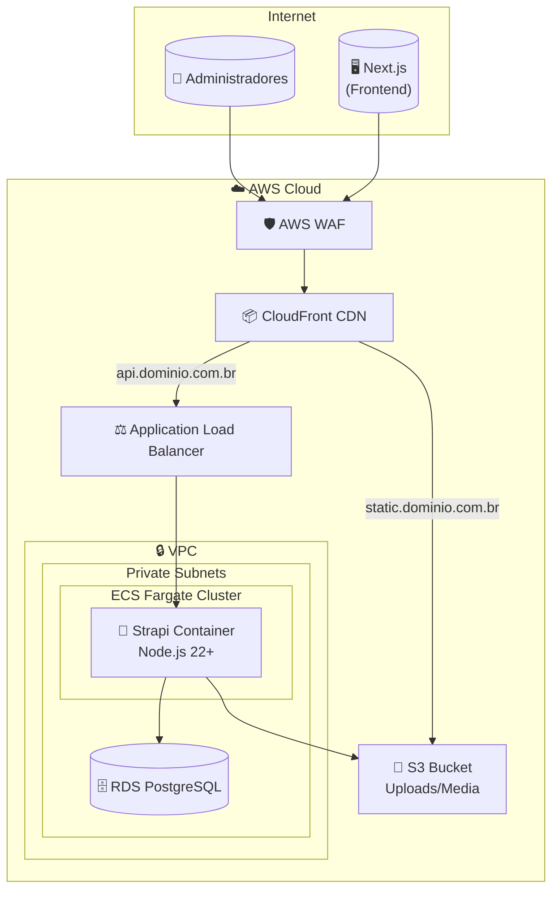

# Grupo SER - CMS (Strapi)

CMS headless construído com **Strapi 5** para gerenciamento de conteúdo.

## 🏗️ Arquitetura de Infraestrutura AWS



## 📋 Requisitos de Infraestrutura

| Recurso | Configuração | Descrição |
|---------|--------------|-----------|
| **Container Runtime** | Docker | Imagem baseada em Node.js 22 Alpine |
| **Porta** | `1337` | Porta padrão do Strapi |
| **Memória** | 1GB - 2GB | Recomendado para produção |
| **CPU** | 0.5 - 1 vCPU | Escalável conforme demanda |
| **Health Check** | `GET /_health` | Endpoint para verificação de saúde |

## 🔧 Variáveis de Ambiente

| Variável | Obrigatória | Descrição |
|----------|-------------|-----------|
| `DATABASE_CLIENT` | ✅ | `postgres` |
| `DATABASE_HOST` | ✅ | Endpoint do RDS |
| `DATABASE_PORT` | ✅ | `5432` |
| `DATABASE_NAME` | ✅ | Nome do banco de dados |
| `DATABASE_USERNAME` | ✅ | Usuário do banco |
| `DATABASE_PASSWORD` | ✅ | Senha do banco (usar Secrets Manager) |
| `AWS_ACCESS_KEY_ID` | ✅ | Credencial AWS para S3 |
| `AWS_ACCESS_SECRET` | ✅ | Secret AWS para S3 |
| `AWS_REGION` | ✅ | Região AWS (ex: `us-east-1`) |
| `AWS_BUCKET` | ✅ | Nome do bucket S3 |
| `APP_KEYS` | ✅ | Chaves de segurança do Strapi |
| `API_TOKEN_SALT` | ✅ | Salt para tokens de API |
| `ADMIN_JWT_SECRET` | ✅ | Secret JWT do admin |
| `JWT_SECRET` | ✅ | Secret JWT geral |
| `NODE_ENV` | ✅ | `production` |

## 🐳 Build Docker

```bash
# Build da imagem
docker build -t grupo-ser-strapi .

# Executar localmente (com banco SQLite)
docker run -p 1337:1337 grupo-ser-strapi
```

## 📦 Serviços AWS Necessários

1. **ECR** - Repositório Docker para a imagem
2. **ECS Fargate** - Execução do container
3. **ALB** - Load Balancer com Target Group na porta 1337
4. **RDS PostgreSQL** - Banco de dados (versão 15+)
5. **S3** - Bucket para uploads de mídia
6. **CloudFront** - CDN para servir arquivos do S3
7. **WAF** - Proteção contra ataques web
8. **Secrets Manager** - Armazenamento seguro de credenciais
9. **Route 53** - DNS (opcional)
10. **ACM** - Certificado SSL

## 🗄️ Configuração do RDS

| Parâmetro | Valor Recomendado |
|-----------|-------------------|
| **Engine** | PostgreSQL 15+ |
| **Instance** | db.t3.micro (dev) / db.t3.small (prod) |
| **Storage** | 20GB gp3 (escalável) |
| **Multi-AZ** | Sim (produção) |
| **Backup** | 7 dias |

## 🚀 Deploy

O deploy é automatizado via GitHub Actions. Veja `.github/workflows/deploy-strapi.yml`.
